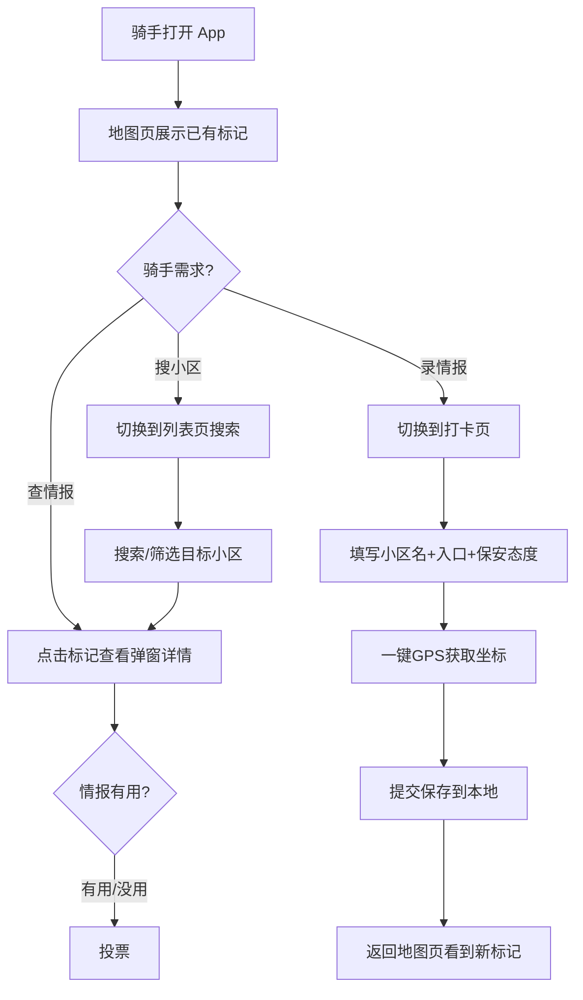

# 骑手通行证 (Rider Pass) · 产品需求文档

**版本**: v1.0 | **日期**: 2026-05-14

---

## 1. 产品概述

骑手通行证是一款面向外卖骑手的**小区/写字楼入口情报共享平台**。骑手标记哪个门能进、保安什么态度、电梯能不能上，让后来的同行少走弯路、多跑几单。

- **目标用户**: 全国外卖骑手、快递员、闪送员
- **核心价值**: 用众包地面情报替代无结构的口口相传，把"最后100米"的成本打下来
- **市场定位**: 纯蓝海细分市场，暂无直接竞品

---

## 2. 核心功能

### 2.1 用户角色

| 角色 | 注册方式 | 核心权限 |
|------|---------|---------|
| 普通骑手 | 输入昵称即可使用 | 浏览情报、打卡录入、查看排行 |
| 情报贡献者 | 打卡 >= 1 条 | 排行榜上榜、数据导出 |

### 2.2 功能模块

1. **地图页（首页）**: 全屏 Leaflet 地图 + 小区标记点，带表情符号区分保安态度
2. **打卡页**: 录入情报表单（小区名 + 入口情况 + 保安态度 + 备注 + GPS 自动定位）
3. **列表页**: 搜索/筛选已录入的情报，按名称或保安态度过滤
4. **我的页**: 个人昵称设置、贡献统计、数据导入导出、清空重置

### 2.3 页面详情

| 页面名称 | 模块名称 | 功能描述 |
|---------|---------|---------|
| 地图页 | 全屏地图 | Leaflet + OpenStreetMap 瓦片，暗色主题，支持缩放拖拽 |
| 地图页 | 标记点 | 4 种颜色+表情区分保安态度（😊友好/😐一般/😠严格/🤬拒绝） |
| 地图页 | 弹窗详情 | 点击标记弹出信息卡：入口描述、保安态度、电梯权限、备注、贡献者 |
| 地图页 | 底部导航 | 固定底部 4 项导航：地图/打卡/列表/我的 |
| 打卡页 | 录入表单 | 小区名称、地址、入口描述、保安态度(4选1)、电梯能否上、备注 |
| 打卡页 | GPS定位 | 一键获取当前 GPS 坐标填入经纬度 |
| 列表页 | 搜索栏 | 按小区名称实时搜索 |
| 列表页 | 筛选标签 | 按保安态度快速筛选（全部/😊/😐/😠/🤬） |
| 列表页 | 情报卡片 | 列表展示情报摘要，点击定位到地图 |
| 我的页 | 昵称设置 | 输入/修改昵称，用于贡献追溯 |
| 我的页 | 贡献统计 | 显示贡献条目数 |
| 我的页 | 排行榜 | 按贡献数降序排列的 TOP 骑手榜单 |
| 我的页 | 数据管理 | JSON 导入/导出、清空重置 |

---

## 3. 核心流程

---

## 4. 用户界面设计

### 4.1 设计风格

- **设计方向**: 「夜行战术地图」— 工业实用主义暗色主题
- **主色调**: OLED 深黑背景 `#0a0a0a`，高对比度霓虹色点缀
  - 友好 😊 → `#4ade80`（绿）- 畅通无阻
  - 一般 😐 → `#facc15`（黄）- 需注意
  - 严格 😠 → `#f97316`（橙）- 有阻力
  - 拒绝 🤬 → `#ef4444`（红）- 禁止进入
- **强调色**: `#3b82f6`（电光蓝）- 按钮、链接、选中态
- **字体**: 系统默认中文字体，数字使用 Tabular Nums 等宽
- **按钮风格**: 大尺寸触摸目标（≥44px），圆角 12px，扁平带微弱渐变
- **布局**: 移动优先，单列布局，底部固定导航栏
- **图标风格**: Lucide Icons 线性图标，18-24px
- **卡片风格**: 8px 圆角，半透明深灰背景，微弱边框

### 4.2 页面设计概览

| 页面名称 | 模块名称 | UI 要素 |
|---------|---------|--------|
| 地图页 | 全屏地图 | 暗色瓦片地图铺满视口，底部导航 56px 高度悬浮 |
| 地图页 | 标记点 | 22px 圆形标记，颜色对应态度，内嵌表情 emoji |
| 地图页 | 弹窗详情 | 底部滑出卡片，280px 高，圆角 16px，半透明毛玻璃背景 |
| 打卡页 | 录入表单 | 白色卡片置于深色背景上，大输入框（48px 高），4 个态度 emoji 大按钮 |
| 列表页 | 搜索栏 | 顶部固定搜索输入框，下方筛选标签横向滚动 |
| 列表页 | 情报卡片 | 左侧态度色条 + 小区名 + 入口摘要，点击跳地图 |
| 我的页 | 排行榜 | 前三名金银铜牌 emoji 🥇🥈🥉 + 昵称 + 贡献数 |

### 4.3 响应式设计

- **设计策略**: 移动优先，桌面端居中展示 420px 宽手机模拟框
- **触摸优化**: 所有可点击元素 ≥ 44×44px，间距 ≥ 8px
- **暗色模式**: 唯一主题，不做亮色切换（骑手户外使用，暗色省电且不刺眼）

---

*文档完 | 2026-05-14*