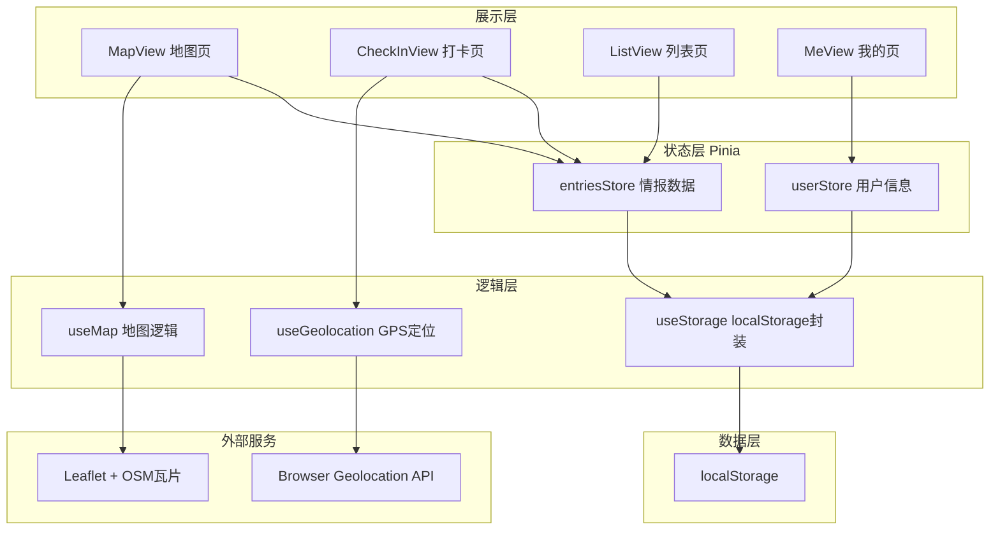

# 骑手通行证 (Rider Pass) · 技术架构文档

**版本**: v1.0 | **日期**: 2026-05-14

---

## 1. 架构设计



---

## 2. 技术选型

| 层级 | 技术 | 版本 | 原因 |
|------|------|------|------|
| 框架 | Vue 3 + TypeScript | ^3.5 | Composition API、类型安全 |
| 构建工具 | Vite | ^6 | 极速 HMR |
| 路由 | Vue Router | ^4 | SPA 页面切换 |
| 状态管理 | Pinia | ^2 | Vue 3 官方推荐 |
| CSS | Tailwind CSS | ^4 | 原子化样式，暗色主题方便 |
| 地图 | Leaflet + OpenStreetMap | ^1.9 | 免费无配额，暗色瓦片 |
| 图标 | Lucide Vue Next | latest | 线性图标，轻量 |
| 存储 | localStorage | 浏览器原生 | MVP 零后端 |
| PWA | vite-plugin-pwa | latest | 离线可用 |
| 部署 | GitHub Pages | - | 零成本 |

---

## 3. 路由定义

| 路由 | 页面 | 说明 |
|------|------|------|
| `/` | MapView | 默认首页，全屏地图 + 标记点 |
| `/checkin` | CheckInView | 打卡录入新情报 |
| `/list` | ListView | 情报列表 + 搜索筛选 |
| `/me` | MeView | 个人中心 + 排行榜 + 数据管理 |

---

## 4. 数据模型

### 4.1 类型定义

```typescript
// 保安态度枚举
type GuardAttitude = 0 | 1 | 2 | 3
// 0 = 😊 友好（让进，态度好）
// 1 = 😐 一般（让进但限时/限路线）
// 2 = 😠 严格（经常拦，看心情放行）
// 3 = 🤬 拒绝（完全不让进，必须走路）

// 情报条目
interface Entry {
  id: string                    // nanoid 生成唯一ID
  name: string                  // 小区/楼宇名称
  address: string               // 详细地址
  lat: number                   // 纬度
  lng: number                   // 经度
  entrance: string              // 入口描述（哪个门、怎么走）
  guardAttitude: GuardAttitude  // 保安态度
  elevatorAccess: boolean       // 电梯能否上楼
  tips: string                  // 额外备注/小贴士
  contributor: string           // 贡献者昵称
  createdAt: number             // 时间戳
  votes: {
    up: number                  // 确认有用的投票数
    down: number                // 确认没用的投票数
  }
}

// 用户信息
interface User {
  nickname: string              // 骑手昵称
  contributionCount: number     // 贡献数量
  joinedAt: number              // 首次使用时间
}

// 应用元数据
interface AppMeta {
  version: string               // 数据版本号
  lastExportAt: number | null   // 上次导出时间
}
```

### 4.2 localStorage 存储结构

| Key | Value | 说明 |
|-----|-------|------|
| `rider_pass_entries` | `Entry[]` JSON | 所有情报条目数组 |
| `rider_pass_user` | `User` JSON | 当前用户信息 |
| `rider_pass_meta` | `AppMeta` JSON | 应用元数据 |

---

## 5. 组件树

```
App.vue
├── BottomNav.vue              # 底部导航栏（始终可见）
└── <RouterView>
    ├── MapView.vue            # / 地图页
    │   ├── EntryPopup.vue     #   弹窗详情卡片
    │   └── (Leaflet Map)      #   地图实例
    ├── CheckInView.vue        # /checkin 打卡页
    │   └── CheckInForm.vue    #   录入表单
    ├── ListView.vue           # /list 列表页
    │   ├── SearchBar.vue      #   搜索框 + 筛选标签
    │   └── EntryCard.vue      #   情报卡片（v-for）
    └── MeView.vue             # /me 我的页
        ├── RankList.vue       #   排行榜
        └── DataManager.vue    #   导入导出按钮组
```

---

## 6. 预置数据策略

在 `src/utils/seeds.ts` 中预置 100 个热门小区的初始情报数据，覆盖城市：

- 温州（试点，20 个）
- 杭州（20 个）
- 北京（20 个）
- 上海（20 个）
- 深圳/广州（20 个）

首次启动时自动合并预置数据到 localStorage，确保新用户打开就有内容可看。

---

*文档完 | 2026-05-14*